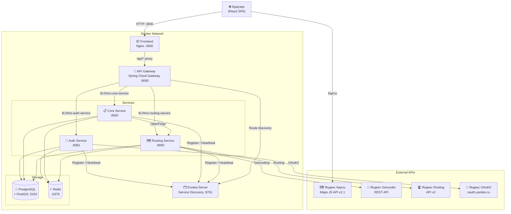
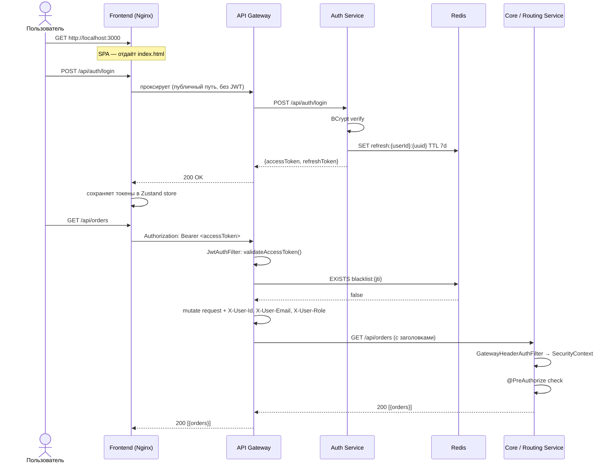
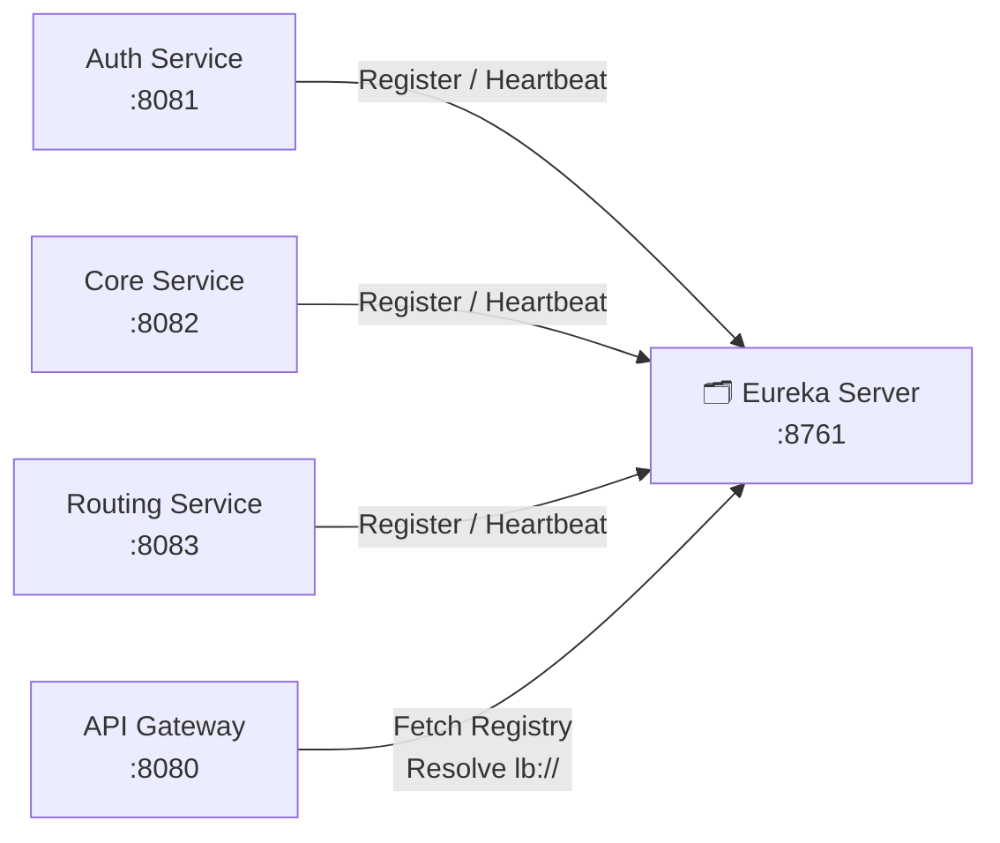
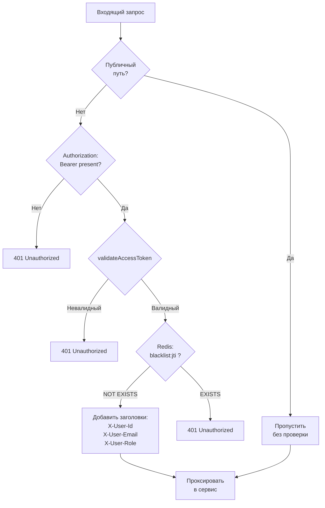
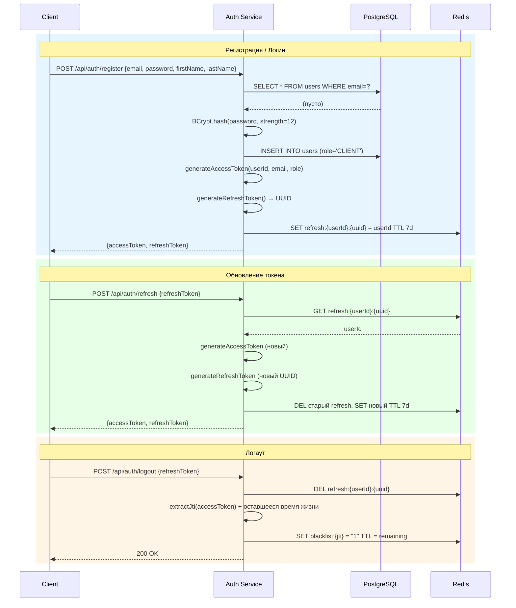
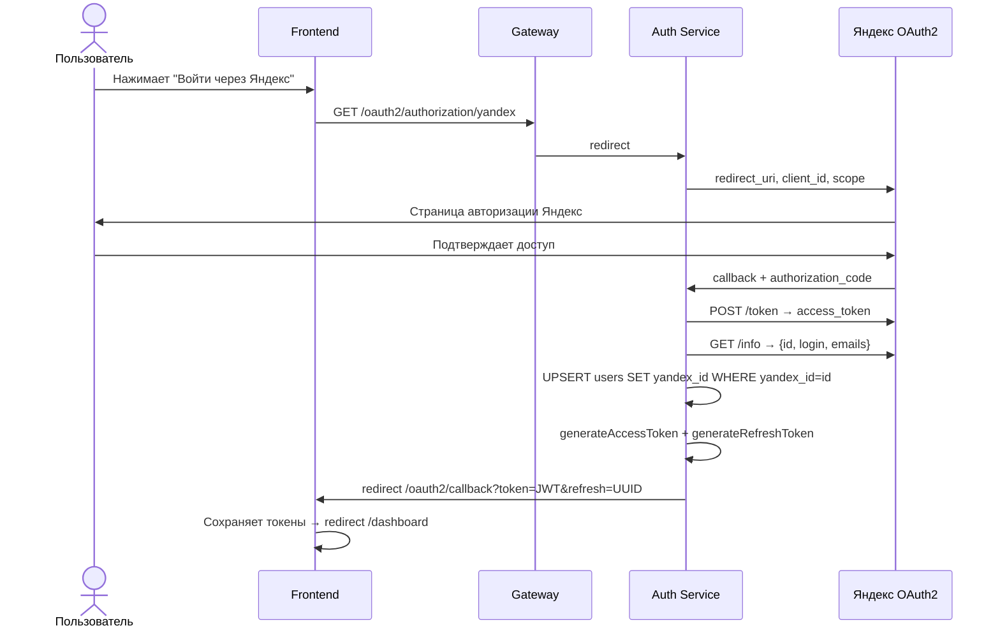
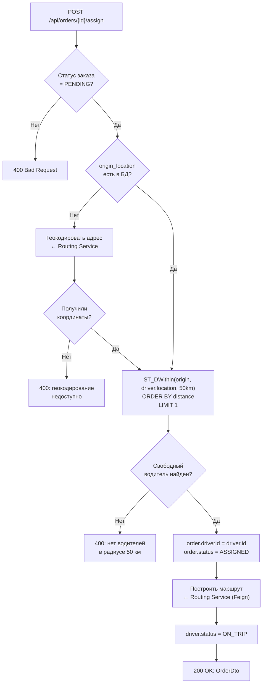
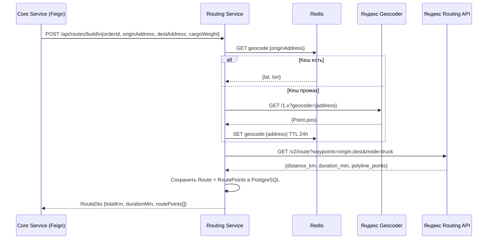
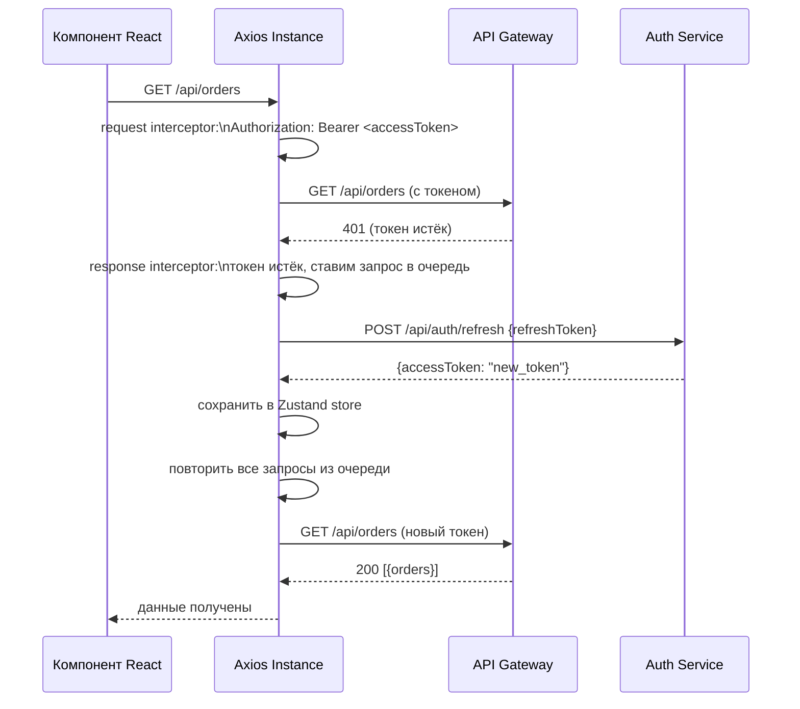
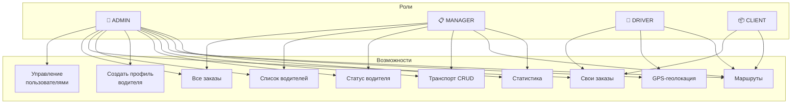

<div align="center">

# 🚛 Маршруты Про

### Платформа управления грузовыми перевозками

*Умная маршрутизация · Реальные данные · Полный контроль*

[](https://marshrutpro.ru)

<br/>


</div>

---

## 📋 Содержание

1. [О проекте](#-о-проекте)
2. [Технологический стек](#-технологический-стек)
3. [Архитектура системы](#-архитектура-системы)
4. [Микросервисы](#-микросервисы)
5. [База данных](#-база-данных)
6. [Ролевая модель](#-ролевая-модель-rbac)
7. [Redis — кеширование](#-redis--кеширование)
8. [Запуск проекта](#-запуск-проекта)
9. [Переменные окружения](#-переменные-окружения)
10. [API Reference](#-api-reference)

---

## 🎯 О проекте

**Маршруты Про** — полнофункциональная платформа для управления транспортной компанией: от приёма заявок до автоматического построения маршрутов и отслеживания рейсов в реальном времени.

<br/>

<table>
<tr>
<td width="50%">

### ✨ Возможности

| | Функция | Описание |
|---|---|---|
| 📦 | **Заказы** | Создание, назначение, отслеживание статуса перевозок |
| 🤖 | **Авто-назначение** | Ближайший свободный водитель через PostGIS |
| 🗺️ | **Маршруты** | Яндекс Routing API — дистанция, время, путевые точки |
| 📍 | **Геокодирование** | Адреса → координаты через Яндекс Geocoder |
| 📡 | **GPS-трекинг** | Логирование координат водителей в реальном времени |
| 🔐 | **Авторизация** | Email/пароль + OAuth2 через Яндекс ID |
| 🗾 | **Интерактивная карта** | Маршруты и водители на Яндекс Картах v2.1 |
| 📊 | **Аналитика** | Дашборды по заказам, водителям и флоту |

</td>
<td width="50%">

### 👥 Роли пользователей

| Роль | Описание |
|---|---|
| 👑 **ADMIN** | Полный доступ: все сущности и пользователи |
| 📋 **MANAGER** | Заказы, водители, транспорт |
| 🚛 **DRIVER** | Свои рейсы, обновление геолокации |
| 📦 **CLIENT** | Создание заказов, отслеживание |

</td>
</tr>
</table>

---

## 🛠 Технологический стек

<table>
<tr>
<td width="50%">

### ⚙️ Backend

| Технология | Версия |
|---|---|
| Java | 17 |
| Spring Boot | 3.1.x |
| Spring Cloud (Netflix OSS) | 2022.0.x |
| Netflix Eureka (Service Discovery) | — |
| Spring Cloud Gateway (WebFlux) | — |
| Spring Security + JWT (JJWT) | 0.11.5 |
| Spring Security OAuth2 Client | — |
| Spring Data JPA + Hibernate Spatial | — |
| PostgreSQL + PostGIS | 15 / 3.3 |
| Redis | 7.2 |
| OpenFeign | — |
| Spring RestClient | — |
| Maven (multi-module) | — |

</td>
<td width="50%">

### 🎨 Frontend

| Технология | Версия |
|---|---|
| React | 18.3 |
| Vite | 5.3 |
| Tailwind CSS | 3.4 |
| React Router | 6.24 |
| Zustand | 4.5 |
| Axios (с interceptors) | 1.7 |
| Framer Motion | 11.3 |
| Recharts | 2.12 |
| Lucide React | 0.414 |
| Яндекс Карты JS API | 2.1 |
| Nginx | 1.25 |

</td>
</tr>
</table>

> 🏗️ **Инфраструктура:** Docker Compose · PostGIS (`ST_DWithin`, GIST-индексы) · Партиционированные таблицы для GPS-логов

---

## 🏛 Архитектура системы

Система построена по принципу **микросервисной архитектуры**. Все сервисы регистрируются в Eureka, взаимодействуют через API Gateway, а общий код вынесен в библиотеку `tms-common-lib`.



### 🔄 Поток запроса через систему



---

## 🔌 Микросервисы

### 🗂️ Eureka Server — Service Discovery

**Порт:** `8761`

Центральный реестр сервисов. Все микросервисы при старте регистрируются здесь и обновляют статус каждые 30 секунд. Gateway использует Eureka для балансировки нагрузки (`lb://`).



> 📊 **Dashboard:** `http://localhost:8761` — визуальный реестр всех зарегистрированных экземпляров

---

### 🔀 API Gateway

**Порт:** `8080` · **Технология:** Spring Cloud Gateway (реактивный, WebFlux)

Единая точка входа. Валидирует JWT, проверяет Redis-blacklist и проксирует запросы.

#### Таблица маршрутов

| Путь | Сервис | Доступ |
|---|---|:---:|
| `POST /api/auth/login` | tms-auth-service | 🟢 Public |
| `POST /api/auth/register` | tms-auth-service | 🟢 Public |
| `POST /api/auth/refresh` | tms-auth-service | 🟢 Public |
| `/api/auth/**` | tms-auth-service | 🔒 JWT |
| `/oauth2/**`, `/login/oauth2/**` | tms-auth-service | 🟢 Public |
| `/api/orders/**` | tms-core-service | 🔒 JWT |
| `/api/drivers/**` | tms-core-service | 🔒 JWT |
| `/api/vehicles/**` | tms-core-service | 🔒 JWT |
| `/api/stats/**` | tms-core-service | 🔒 JWT |
| `/api/routes/**` | tms-routing-service | 🔒 JWT |

#### Работа JWT-фильтра



После успешной валидации в запрос добавляются заголовки, которые downstream-сервисы используют для авторизации:

```
X-User-Id:    42
X-User-Email: user@example.com
X-User-Role:  MANAGER
```

---

### 🔐 Auth Service — Аутентификация

**Порт:** `8081` · **БД:** таблица `users`

Управление пользователями, выдача JWT-токенов, OAuth2 через Яндекс.

#### Полный поток аутентификации



#### OAuth2 — Яндекс ID



#### Структура JWT токена

```
Header  → { "alg": "HS256", "typ": "JWT" }

Payload → {
  "sub":   "42",              ← userId
  "email": "user@mail.ru",
  "role":  "MANAGER",
  "jti":   "uuid-v4",        ← уникальный ID для blacklist
  "iat":   1714500000,
  "exp":   1714500900         ← +15 минут
}
```

#### Endpoints

| Метод | Путь | Доступ | Описание |
|:---:|---|:---:|---|
| `POST` | `/api/auth/register` | 🟢 Public | Регистрация |
| `POST` | `/api/auth/login` | 🟢 Public | Логин |
| `POST` | `/api/auth/refresh` | 🟢 Public | Обновить токен |
| `POST` | `/api/auth/logout` | 🔒 JWT | Выйти |
| `GET` | `/api/auth/me` | 🔒 JWT | Текущий пользователь |
| `GET` | `/api/auth/admin/users` | 👑 ADMIN | Список пользователей |
| `POST` | `/api/auth/admin/users` | 👑 ADMIN | Создать пользователя |
| `DELETE` | `/api/auth/admin/users/{id}` | 👑 ADMIN | Удалить пользователя |

---

### 📋 Core Service — Бизнес-логика

**Порт:** `8082` · **БД:** `orders`, `drivers`, `vehicles`, `locations_log`

Управление заказами, водителями, транспортом. Автоматическое назначение водителя с геопоиском через PostGIS.

#### Логика назначения водителя



#### Авторизация через заголовки Gateway

```java
// GatewayHeaderAuthFilter.java
String role = request.getHeader("X-User-Role"); // "MANAGER"
new SimpleGrantedAuthority("ROLE_" + role);      // → "ROLE_MANAGER"
// Теперь @PreAuthorize("hasRole('MANAGER')") работает
```

#### Endpoints

| Метод | Путь | Роли | Описание |
|:---:|---|---|---|
| `POST` | `/api/orders` | ADMIN, MANAGER, CLIENT | Создать заказ |
| `GET` | `/api/orders` | ADMIN, MANAGER | Все заказы |
| `GET` | `/api/orders/my` | CLIENT, DRIVER | Свои заказы |
| `GET` | `/api/orders/{id}` | Authenticated | Заказ по ID |
| `PATCH` | `/api/orders/{id}/status` | ADMIN, MANAGER, DRIVER | Обновить статус |
| `POST` | `/api/orders/{id}/assign` | ADMIN, MANAGER | Назначить водителя |
| `DELETE` | `/api/orders/{id}` | ADMIN, MANAGER | Удалить заказ |
| `GET` | `/api/drivers` | ADMIN, MANAGER | Все водители |
| `POST` | `/api/drivers` | ADMIN | Создать профиль водителя |
| `PATCH` | `/api/drivers/{id}/status` | ADMIN, MANAGER | Статус водителя |
| `POST` | `/api/drivers/{id}/location` | DRIVER | Обновить геолокацию |
| `GET` | `/api/vehicles` | ADMIN, MANAGER | Транспорт |
| `POST` | `/api/vehicles` | ADMIN | Создать ТС |
| `PUT` | `/api/vehicles/{id}` | ADMIN | Обновить ТС |
| `DELETE` | `/api/vehicles/{id}` | ADMIN | Удалить ТС |
| `GET` | `/api/stats/summary` | ADMIN, MANAGER | Сводная статистика |

---

### 🗺️ Routing Service — Маршрутизация

**Порт:** `8083` · **БД:** `routes`, `route_points`

Геокодирование адресов, построение маршрутов через Яндекс API, кеширование в Redis.



#### Endpoints

| Метод | Путь | Описание |
|:---:|---|---|
| `POST` | `/api/routes/build` | Построить маршрут для заказа |
| `GET` | `/api/routes/{orderId}` | Маршрут по ID заказа |
| `POST` | `/api/routes/geocode` | Геокодировать адрес → координаты |

---

### 🎨 Frontend — React + Vite

**Порт:** `3000` · Nginx отдаёт статику SPA и проксирует `/api/*` → Gateway.

#### Структура приложения

```
src/
├── 📁 api/           # Axios-клиенты (authApi, ordersApi, driversApi, routesApi)
├── 📁 components/    # Layout, Navbar, StatusBadge, RouteMap
├── 📁 pages/         # LandingPage, DashboardPage, OrdersPage...
├── 📁 router/        # AppRouter + PrivateRoute (RBAC)
└── 📁 store/         # Zustand: authStore, ordersStore
```

#### Механизм обновления токена (Axios interceptors)



#### Маршруты и доступ

| Путь | Компонент | Роли |
|---|---|---|
| `/` | LandingPage | Все |
| `/login` | LoginPage | Все |
| `/register` | RegisterPage | Все |
| `/oauth2/callback` | OAuth2CallbackPage | Все |
| `/dashboard` | DashboardPage | Authenticated |
| `/orders` | OrdersPage | ADMIN, MANAGER, CLIENT, DRIVER |
| `/orders/:id` | OrderDetailPage | Authenticated |
| `/drivers` | DriversPage | ADMIN, MANAGER |
| `/vehicles` | VehiclesPage | ADMIN, MANAGER |
| `/map` | MapPage | Authenticated |
| `/admin/users` | UsersPage | ADMIN |
| `/admin/dispatchers` | UsersPage (MANAGER) | ADMIN |

---

## 🗄 База данных

Все сервисы используют одну базу **PostgreSQL 15 + PostGIS 3.3** (`tms_db`). Схема логически разделена по сервисам.

### Таблицы

| Таблица | Сервис | Назначение |
|---|---|---|
| `users` | Auth | Аккаунты пользователей |
| `vehicles` | Core | Транспортные средства |
| `drivers` | Core | Профили водителей |
| `orders` | Core | Заказы на перевозку |
| `routes` | Routing | Маршруты |
| `route_points` | Routing | Точки маршрута |
| `locations_log` | Core | История GPS-координат *(партиционирована по месяцам)* |

### ER-диаграмма

```mermaid
erDiagram
    users {
        bigserial id PK
        varchar email UK
        varchar password
        varchar first_name
        varchar last_name
        varchar role
        varchar yandex_id UK
        timestamp created_at
    }

    vehicles {
        bigserial id PK
        varchar plate_number UK
        varchar model
        varchar cargo_type
        numeric max_weight
        numeric max_volume
        varchar status
    }

    drivers {
        bigserial id PK
        bigint user_id UK
        bigint vehicle_id FK
        varchar license_no UK
        varchar status
    }

    orders {
        bigserial id PK
        bigint client_id
        bigint driver_id FK
        text origin_address
        text dest_address
        geometry origin_location
        geometry dest_location
        numeric cargo_weight
        numeric cargo_volume
        varchar status
        timestamp created_at
        timestamp updated_at
    }

    routes {
        bigserial id PK
        bigint order_id UK_FK
        numeric total_km
        integer duration_min
        varchar status
        timestamp created_at
    }

    route_points {
        bigserial id PK
        bigint route_id FK
        integer seq_number
        text address
        geometry location
        varchar point_type
    }

    locations_log {
        bigserial id
        bigint driver_id
        geometry location
        timestamp recorded_at
    }

    users ||--o{ drivers : "user_id (логическая)"
    users ||--o{ orders : "client_id (логическая)"
    vehicles ||--o| drivers : "vehicle_id"
    drivers ||--o{ orders : "driver_id"
    orders ||--o| routes : "order_id"
    routes ||--o{ route_points : "route_id"
    drivers ||--o{ locations_log : "driver_id (логическая)"
```

> 💡 **Примечание:** Связи `users → drivers`, `users → orders`, `drivers → locations_log` — **логические** (без FK в БД). Это осознанное решение микросервисной архитектуры: `users` живёт в Auth Service, остальные таблицы — в Core Service.

---

## 🛡 Ролевая модель (RBAC)



### Матрица доступа к API

| Endpoint | 👑 ADMIN | 📋 MANAGER | 🚛 DRIVER | 📦 CLIENT |
|---|:---:|:---:|:---:|:---:|
| `POST /api/orders` | ✅ | ✅ | — | ✅ |
| `GET /api/orders` | ✅ | ✅ | — | — |
| `GET /api/orders/my` | — | — | ✅ | ✅ |
| `PATCH /api/orders/{id}/status` | ✅ | ✅ | ✅ | — |
| `POST /api/orders/{id}/assign` | ✅ | ✅ | — | — |
| `GET /api/drivers` | ✅ | ✅ | — | — |
| `POST /api/drivers` | ✅ | — | — | — |
| `POST /api/drivers/{id}/location` | — | — | ✅ | — |
| `GET /api/vehicles` | ✅ | ✅ | — | — |
| `POST/PUT/DELETE /api/vehicles` | ✅ | — | — | — |
| `GET /api/routes/{orderId}` | ✅ | ✅ | ✅ | ✅ |
| `GET /api/stats/summary` | ✅ | ✅ | — | — |
| `GET /api/auth/admin/users` | ✅ | — | — | — |

---

## ⚡ Redis — Кеширование

| Назначение | Ключ | TTL | Сервис |
|---|---|:---:|---|
| 🔑 Refresh-токены | `refresh:{userId}:{uuid}` | 7 дней | Auth |
| 🚫 JWT-blacklist (logout) | `blacklist:{jti}` | Остаток жизни токена | Auth / Gateway |
| 📍 Кеш геокодирования | `geocode:{address}` | 24 часа | Routing |
| 🗺️ Кеш маршрутов | `route:{hash}` | 1 час | Routing |

### Демонстрация эффекта кеша

Первый запрос `GET /api/drivers` идёт в PostgreSQL (~150–200 мс), последующие отдаются из Redis (~5–15 мс):

```
Итерация  1 →  187 ms  ← холодный старт, запрос в БД
Итерация  2 →   23 ms  ← Redis hit
Итерация  3 →   11 ms
Итерация  4 →    9 ms
...
Итерация 50 →    7 ms  ← стабильный кеш
```

---

## 🚀 Запуск проекта

### Требования

- Docker Desktop 24+
- 4 GB RAM доступно для Docker

### Быстрый старт

```bash
# 1. Склонируйте репозиторий
git clone <repo-url>
cd Transport_company

# 2. Создайте файл переменных окружения
cp .env.example .env
# Заполните значения (см. раздел ниже)

# 3. Запустите все сервисы
docker compose up -d --build

# 4. Проверьте статус
docker compose ps
```

### Проверка готовности

| Сервис | URL | Ожидаемый результат |
|---|---|---|
| 🌐 Frontend | http://localhost:3000 | Лендинг Маршруты Про |
| 🗂️ Eureka Dashboard | http://localhost:8761 | Все 4 сервиса зарегистрированы |
| 🔀 Gateway Health | http://localhost:8080/actuator/health | `{"status":"UP"}` |
| 🔐 Auth Health | http://localhost:8081/actuator/health | `{"status":"UP"}` |

### Первый вход

```
Email:    admin@tms.ru
Пароль:   Admin@123
```

### Пересборка отдельного сервиса

```bash
# Пересобрать и перезапустить фронтенд
docker compose build frontend && docker compose up -d frontend

# Пересобрать core-service без кеша
docker compose build --no-cache core-service && docker compose up -d core-service
```

### Структура репозитория

```
Transport_company/
├── 📄 pom.xml                    # Maven parent POM
├── 📄 docker-compose.yml
├── 📄 init.sql                   # Схема БД + seed данные
├── 📄 .env                       # Переменные окружения (не коммитить!)
│
├── 📦 tms-common-lib/            # Общие DTO, исключения, JWT-утилиты
├── 🗂️ tms-eureka-server/         # Netflix Eureka (service discovery)
├── 🔀 tms-api-gateway/           # Spring Cloud Gateway + JWT-фильтр
├── 🔐 tms-auth-service/          # Регистрация, логин, Яндекс OAuth2
├── 📋 tms-core-service/          # Заказы, водители, транспорт
├── 🗺️ tms-routing-service/       # Яндекс Routing / Geocoder API
└── 🎨 tms-frontend/              # React + Vite + Tailwind CSS
```

---

## ⚙️ Переменные окружения

Создайте файл `.env` в корне проекта (используйте `.env.example` как шаблон):

```env
# ─── База данных ────────────────────────────────────
DB_PASSWORD=your_strong_password

# ─── Redis ──────────────────────────────────────────
REDIS_PASSWORD=your_redis_password

# ─── JWT (минимум 32 символа) ───────────────────────
JWT_SECRET=your_very_long_secret_key_minimum_32_chars

# ─── Яндекс OAuth2 ──────────────────────────────────
YANDEX_CLIENT_ID=your_yandex_oauth_client_id
YANDEX_CLIENT_SECRET=your_yandex_oauth_client_secret

# ─── Яндекс API ─────────────────────────────────────
YANDEX_GEOCODER_API_KEY=your_geocoder_api_key
VITE_YANDEX_MAPS_KEY=your_maps_js_api_key

# ─── Frontend URL (для OAuth2 callback) ─────────────
FRONTEND_URL=http://localhost:3000
```

> 🔑 Получить ключи Яндекс: [developer.tech.yandex.ru](https://developer.tech.yandex.ru)

---

## 📡 API Reference

### Аутентификация

```bash
# Регистрация
curl -X POST http://localhost:8080/api/auth/register \
  -H "Content-Type: application/json" \
  -d '{"email":"user@mail.ru","password":"Pass123!","firstName":"Иван","lastName":"Иванов"}'

# Логин
curl -X POST http://localhost:8080/api/auth/login \
  -H "Content-Type: application/json" \
  -d '{"email":"admin@tms.ru","password":"Admin@123"}'

# Профиль текущего пользователя
curl http://localhost:8080/api/auth/me \
  -H "Authorization: Bearer <accessToken>"

# Выход
curl -X POST http://localhost:8080/api/auth/logout \
  -H "Authorization: Bearer <accessToken>" \
  -H "Content-Type: application/json" \
  -d '{"refreshToken":"<refreshToken>"}'
```

### Заказы

```bash
# Создать заказ
curl -X POST http://localhost:8080/api/orders \
  -H "Authorization: Bearer <token>" \
  -H "Content-Type: application/json" \
  -d '{
    "originAddress": "Москва, ул. Тверская, 1",
    "destAddress": "Санкт-Петербург, Невский пр., 1",
    "cargoWeight": 1500,
    "cargoVolume": 10
  }'

# Автоматически назначить водителя
curl -X POST http://localhost:8080/api/orders/1/assign \
  -H "Authorization: Bearer <token>"

# Обновить статус
curl -X PATCH http://localhost:8080/api/orders/1/status \
  -H "Authorization: Bearer <token>" \
  -H "Content-Type: application/json" \
  -d '{"status":"IN_PROGRESS"}'
```

### Водители

```bash
# Создать профиль водителя
curl -X POST http://localhost:8080/api/drivers \
  -H "Authorization: Bearer <adminToken>" \
  -H "Content-Type: application/json" \
  -d '{"userId": 3, "licenseNo": "77 АА 123456"}'

# Обновить геолокацию (от имени водителя)
curl -X POST http://localhost:8080/api/drivers/1/location \
  -H "Authorization: Bearer <driverToken>" \
  -H "Content-Type: application/json" \
  -d '{"lat": 55.7558, "lon": 37.6173}'
```

### Маршруты и геокодирование

```bash
# Получить маршрут заказа
curl http://localhost:8080/api/routes/1 \
  -H "Authorization: Bearer <token>"

# Геокодировать адрес
curl -X POST http://localhost:8080/api/routes/geocode \
  -H "Authorization: Bearer <token>" \
  -H "Content-Type: application/json" \
  -d '{"address": "Москва, Красная площадь"}'
```

---

<div align="center">

Дипломная работа · Гизатулин Никита · 2025

</div>
